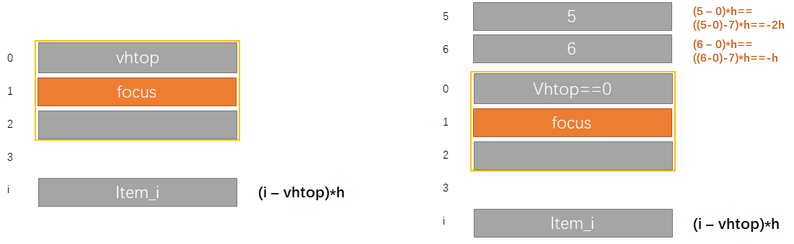

# loop-picker

> **仅供学习参考**
> `wepy` 组件

模拟微信小程序官方`picker`的*可循环`picker`*--**`loop-picker`**.

1. 使用感受没有官方的`swiper`流畅;
2. 但交互上比`picker`类组件更好用, 支持**循环滑动**, 支持**直接点击修改focus的值**.


### 演示


编辑`focus`直接切换 item :


### 使用

```
# git clone ...
npm install
wepy build
# 微信开发者工具导入项目, 即可预览demo 
```


### 核心原理


相关概念:

- Item: 每个选择项
- 容器: 组件最外层容器
- 视窗: 展示item的区域
- VH=VC: 视窗高度等于容器高度
- vn: 指定视窗内显示多少个item, 必须奇数.
- focus: 当前处于视窗正中的item, 即选中项.
- top: 当前定位在最上面的item
- bottom: 定位处于最下面的item
- vhtop: 视窗内最上面的item.

先看最基本的 item 排列方法:


<图1> 

通过对视窗容器绑定`touchstart`,`touchmove`,`touchend`, 可以很容易得到滑动距离: `dm`. 然后对上面每个item增加`dm`的位移, 就很容实现item的滑动.


但是, **关键的循环滑动** 却无法实现.


先来看一个有意思的'数学题':


问: $1-6=?$, $2-5=?$, $4-1=?$

视图渲染用的数据集是个数组, 但是由于需要循环滚动. 这样, 原本处于最后一位的 6 , 必然可能定位到 0 的上方. 所以, 你的数据物理上肯定是个线形*数组*, 但是实际上, 它是个**环形数组**.

所以, 上面的几个结果, 要取决于, 当前数据所处的逻辑状态: *top 元素(0位置)是谁*.

以 $6-0$ 为例, 当top元素时0时, 也就是上图第一行的状态. 这时结果是 6. 如果是第二行的状态, 那结果应该是 -1. 表示 6 在 0 前面1位.

通用公式:

```js
let before, after;
let originDiff = after-before;
if(originDiff>=0){
	return originDiff;
}else{
	return length + originDiff;	// length: 数组长度
}
```


数学题先放一边, 再来看下图, 其实就是*图1*的一般情况:


<图2> 

上图左边的公式 $(i-vhtop)*h$ 可以轻松解决不循环情况下item的定位问题. 

右边, 正是上面数学题的应用, 从而轻松解决了, 循环情况下 item 的定位问题.


实际代码实现时, 涉及到一个**反转**的概念. 

虽然, 通过上面有意思的数学题, 就能轻松让谁在上面, 谁在下面, 以及位移多少. 但是, 这个时机, 或者条件怎么把握, 那 6 为例, 什么时候它应该在下面, 什么时候它应该在上面. 以vhtop为基准, 任意item, $i-vhtop$ 的结果可正可负, 一般情况下, 正的, item, 位于 vhtop 下方; 负的, 位于 vhtop 上方. 但是这样, 可能会导致所有 item 集中在 vhtop 下方, 比如 vhtop==0 时. 想要实现循环的关键就是, 动态的保证视窗上下的 item 比较均匀. 

所以, **就需要设置一定条件, 当达到这个条件时, 即使 $i-vhtop$ 结果为负(一般情况下在上方, 也要放到下方; 反之, 结果为正(一般情况下在下方), 也要放到上方去. 这就是所谓的反转.** 

我这里, 设置一个 `reverseThreshold` 变量, 来作为反转的条件. 该变量决定了, items 在 vhtop 上下的分布情况. `reverseThreshold` 具体又分为上和下: `upThres`和`downThres`.

以 7 个 item 为例, 设置 `downThres=4`, `upThres=3` (实际取值, 根据`vn`和`items.length`决定, 一般建议, 奇数item时, focus 上下等分; 奇数时, 下方多一个, 然后, 进一步根据`vn`推算出vhtop上下的分配情况, 得到这个阈值).

 怎么根据`reverseThreshold` 维护上下item动态平衡呢?

<伪码>

```js
// 计算当前item应该便宜vhtop多少个h(初步值)
let dn = i - vhtop;
if (dn <= upThres) {
    // 反转到下方
    dn += len;
}else if (dn >= downThres) {
    // 反转到上方
    dn -= len;
}else {
    // 无需反转
}
// 当前item最终的Y轴偏移量 = 相当于vhtop偏移多少个item高度 + 触摸移动距离
return dn * h + dm;
```


那么, 实现循环滚动的关键就在这里了:

你不用考虑任何复杂的逻辑来实现循环了. **仅仅动态改变`vhtop`的值, 就自动循环了, 因为`vhtop`上下的item自动实现了均衡分布--永远滑动不到头**. 进一步`vhtop`是根据指定的`focus`计算得到, 所以, **动态更新`focus`的值就可以实现循环滚动**.

`focus`的更新策略, 在触摸事件中, 可以想怎么做就怎么做了. 至于我怎么做的, 我就不啰嗦了, 有兴趣看代码吧.

总之, 记住: `focus`更新, 视图更新, 视图更新, 自动就是循环效果的, 因为你永远滑不到头.


PS: 1. 怎么实现 focus item 可输入值得; 2. input框的光标怎么消失的(小程序input的光标时无法隐藏, 其实); 这些小hack就不啰嗦了.


---

后记:

由于我想要的`picker`不能只是从底部弹起, 要能够循环滑动, 要能够直接输入值改变item. 同时满足这些要求的官方组件没有. `picker`系列, `swiper`, `scroll-view`, 都了解的童鞋应该知道, 都是不能满足这些条件的. 于是, 自己动手, 基于`swiper`实现了我要的效果, 但是, 很遗憾, 感觉滑动时, 卡顿, 体验明显欠佳. 导致我都不好意思让我的小程序推荐给别人用.

于是, 逼着我再次动手, 自己实现. 至此, 貌似还满意. 欢迎吐槽!!!


